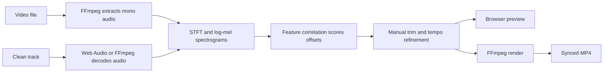

# AVSync

> Browser-based audio video sync tool for aligning external audio with video,
> previewing the result, and exporting a synced MP4 locally.

[](https://github.com/Dhi13man/avsync/actions/workflows/ci.yml)
[](https://nodejs.org)
[](LICENSE)
[](CONTRIBUTING.md)
[](CODE_OF_CONDUCT.md)

AVSync is a local-first browser tool that helps you fit an external clean audio
track to a video. Load both files, decode their audio, inspect aligned
spectrograms, choose or nudge an offset, preview the result, and render a video
with the original video stream plus the replacement audio. User media stays on
your machine.

## Features

- Automatic alignment estimates from spectrogram feature correlation.
- Tempo refinement for recordings that drift slightly over time.
- Negative offsets for cases where the clean track starts after the video.
- Frame-scale nudges, spectrogram dragging, playhead scrubbing, and looped
  review.
- Preview modes for clean audio, blended audio, and original video audio.
- FFmpeg WASM export with `-c:v copy` and AAC replacement audio.
- Static-host-compatible FFmpeg worker loading for GitHub Pages.
- Light and dark themes through native `color-scheme`.

## Prerequisites

- Node.js 18 or later.
- A recent Chromium, Firefox, or Safari build with WebAudio, Canvas2D, Web
  Worker, and WebAssembly support.
- Network access to jsDelivr when FFmpeg WASM assets are first loaded.

## Quick start

```bash
git clone https://github.com/Dhi13man/avsync.git
cd avsync
npm start
```

Expected output:

```text
AVSync running at http://127.0.0.1:5177
```

Open <http://127.0.0.1:5177>.

## Usage

1. Load a video file and the clean audio track.
2. Click **Decode Media**.
3. Click **Estimate Match** and select the best candidate if needed.
4. Use **Track start**, nudges, or spectrogram dragging to refine sync.
5. Preview in **Clean track**, **Blend**, or **Original video** mode.
6. Click **Render File** to export a synced MP4.

## Keyboard shortcuts

| Key | Action |
| --- | --- |
| `Space` | Play or pause |
| `Left Arrow` / `Right Arrow` | Nudge track start by 100 ms |
| `Shift` + arrow | Nudge track start by 1 s |
| `Alt` + arrow | Nudge track start by one frame, roughly 33 ms |
| `L` | Toggle loop playback |

Shortcuts are ignored while focus is inside an input or select.

## Development

Install development dependencies only when you need validation tools:

```bash
npm install
npm run check
```

The app has no runtime npm dependencies. The development dependency is used for
markdown linting.

### Scripts

| Command | Purpose |
| --- | --- |
| `npm start` | Serve the app at `http://127.0.0.1:5177` |
| `npm run check:js` | Syntax-check `server.js` and `public/app.js` |
| `npm run lint:md` | Lint markdown documentation |
| `npm run check` | Run all local checks |

### Project structure

| Path | Purpose |
| --- | --- |
| `public/index.html` | App shell, controls, and preview markup |
| `public/styles.css` | CSS layers, layout, components, and responsive behavior |
| `public/app.js` | Audio decode, spectrogram analysis, preview, and export logic |
| `server.js` | Local static server, isolation headers, and FFmpeg asset fallback proxy |
| `.github/` | Community files, issue templates, PR template, and CI |
| `docs/RELEASE.md` | Release checklist |

## Hosting

The app can be deployed to GitHub Pages from the static files in `public/`.
See [docs/GITHUB_PAGES.md](docs/GITHUB_PAGES.md) for the workflow, default
project URL, and custom-domain setup.

## How it works



Important implementation details:

- Spectrograms are cached as offscreen bitmaps and redrawn as cropped views.
- Negative trim uses `adelay` in the export filter so a clean track can start
  after the video.
- Dragging trim during playback reseeks the clean audio source so preview stays
  responsive.
- Static hosts serve the FFmpeg wrapper worker from `public/vendor/`, while the
  large FFmpeg WASM core is loaded through same-origin Blob URLs at runtime.

## Browser requirements

| Capability | Requirement |
| --- | --- |
| Audio APIs | WebAudio `decodeAudioData` and `AudioBufferSourceNode` |
| Rendering APIs | Canvas2D and Web Workers |
| FFmpeg export | WebAssembly-capable browser session and jsDelivr asset access |

Large videos are constrained by browser memory and local I/O. For long or 4K
media, use shorter test clips while tuning algorithm changes.

## Roadmap

- [ ] Multi-region alignment for videos that need re-sync at different
  timecodes.
- [ ] Waveform overlay on top of spectrograms.
- [ ] DTW-based fine alignment as an alternative to fixed-tempo refinement.
- [ ] Local project-state persistence.
- [ ] Export presets for proxy, mezzanine, and deliverable workflows.
- [ ] Optional vendored FFmpeg WASM core for fully offline use.

## Contributing

Bug reports, feature suggestions, and pull requests are welcome. Read
[CONTRIBUTING.md](CONTRIBUTING.md), [CODE_OF_CONDUCT.md](CODE_OF_CONDUCT.md),
and [SECURITY.md](SECURITY.md) before participating.

## Third-party notices

Vendored browser wrapper files are listed in
[THIRD_PARTY_NOTICES.md](THIRD_PARTY_NOTICES.md).

## Changelog

See [CHANGELOG.md](CHANGELOG.md). Versions follow
[Semantic Versioning](https://semver.org/).

## License

MIT. See [LICENSE](LICENSE).
